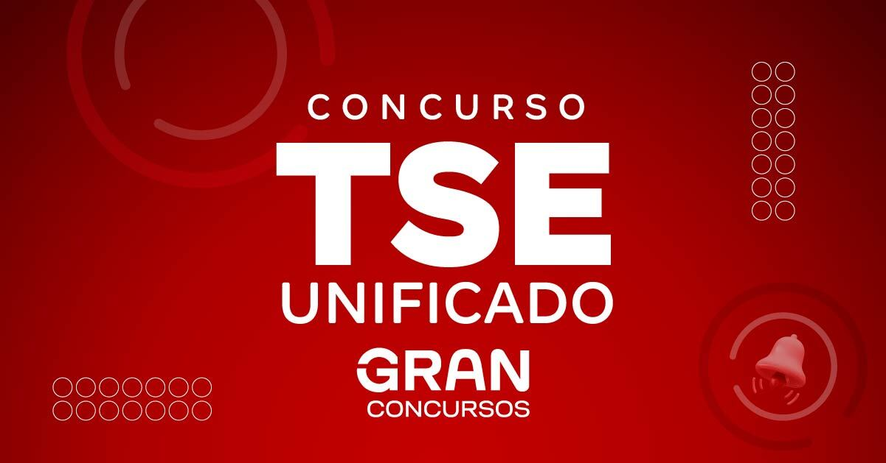

---
@import "css/style.css"
---

# Concurso TREs + TSE Unificado - Cargo: TECNOLOGIA DA INFORMAÇÃO

Repositório para resumos e resenhas relacionadas com o concurso TREs + TSE Unificado para o cargo de TECNOLOGIA DA INFORMAÇÃO.

## Cargo 17: ANALISTA JUDICIÁRIO – ÁREA: APOIO ESPECIALIZADO – ESPECIALIDADE: TECNOLOGIA DA INFORMAÇÃO

- **REQUISITOS**: diploma, devidamente registrado, de conclusão de curso superior na área de Tecnologia da Informação, Análise e Desenvolvimento de Sistemas, Ciência da Computação, Engenharia de Software, TRIBUNAL SUPERIOR ELEITORAL (TSE) Engenharia de Redes, Segurança das Informações, Sistemas de Informação, Engenharia da Computação ou outras correlatas, fornecido por instituição de ensino superior reconhecida pelo MEC.
- **DESCRIÇÃO SUMÁRIA DAS ATIVIDADES**: desenvolver atividades de planejamento, coordenação, desenvolvimento e implantação de Projetos de Sistemas; desenvolver atividades relacionadas ao planejamento, governança, à gestão de tecnologia da informação e à manutenção de rede, banco de dados, e comunicação de dados, dos sistemas informatizados; implementar e monitorar políticas e práticas de segurança da informação; realizar avaliações de risco e auditorias de segurança para identificar potenciais vulnerabilidades e implementar soluções; promover perícias e auditorias de projetos e sistemas de informação; realizar especificações técnicas de equipamentos, softwares e serviços de informática.
- **REMUNERAÇÃO INICIAL**: R$ 13.994,78.
- **JORNADA DE TRABALHO**: 40 horas semanais.

## Último Concurso

- Página do último concurso no CEBRASPE: [CONCURSO PÚBLICO NACIONAL UNIFICADO DA JUSTIÇA ELEITORAL](https://www.cebraspe.org.br/concursos/cpnuje_24)
- [Edital nº 1 – Abertura do Concurso – Atualizado conforme retificações](https://cdn.cebraspe.org.br/concursos/cpnuje_24/arquivos/Edital_1_2024_CPNUJE_Abertura_atualizado_ret_15.pdf)

## Disciplinas do Concurso

| # | Disciplina |
| --- | --- |
| 1 | [ARQUITETURA DE DESENVOLVIMENTO DA PLATAFORMA DIGITAL DO PODER JUDICIÁRIO BRASILEIRO (PDPJ-Br)](./disciplinas/pdpj-br-arquitetura-de-desenvolvimento/readme.md) |
| 2 | [NORMATIVOS DA PDPJ-BR](./disciplinas/pdpj-br-normativos/readme.md) |
| 3 | [ENGENHARIA DE SOFTWARE](./disciplinas/engenharia-de-software/readme.md) |
| 4 | [DESENVOLVIMENTO DE SISTEMAS](./disciplinas/desenvolvimento-de-sistemas/readme.md) |
| 5 | [INFRAESTRUTURA](./disciplinas/infraestrutura/readme.md) |
| 6 | [BANCOS DE DADOS](./disciplinas/bancos-de-dados/readme.md) |
| 7 | [SISTEMAS EMBARCADOS](./disciplinas/sistemas-embarcados/readme.md) |
| 8 | [GESTÃO E GOVERNANÇA DE TECNOLOGIA DA INFORMAÇÃO](./disciplinas/gestao-e-governanca-de-ti/readme.md) |

## Conteúdo Programático

- Legenda: ⚪🟡🟢🟤⚫🔴🟠⬜⚠️⛔⏳⌛⏰🆕❓➖✔✅🆗⬆⬇🔄🚧🎉🎊

### 1. ARQUITETURA DE DESENVOLVIMENTO DA PLATAFORMA DIGITAL DO PODER JUDICIÁRIO BRASILEIRO (PDPJ-Br)

1. Linguagem de programação Java.

2. Arquitetura distribuída de microsserviços; API RESTful; JSON; Framework Spring; Spring Cloud; Spring Boot; Spring Eureka, Zuul; Map Struct; Swagger; Service Discovery; API Gateway.

3. Persistência; JPA 2.0; Hibernate 4.3 ou superior; Hibernate Envers; Biblioteca Flyway.

4. Banco de dados; PostgreSQL; H2 Database.

5. Serviços de autenticação; SSO Single Sign-On; Keycloak; Protocolo OAuth2 (RFC 6749).

6. Mensageria e Webhooks; Message Broker; RabbitMQ; Evento negocial; Webhook; APIs reversas.

7. Ferramenta de versionamento Git.

8. Ambiente de clusters, Kubernetes.

9. Ferramenta de orquestração de containeres, Rancher.

10. Deploy de aplicações; Continuous Delivery e Continuous Integration (CI/CD). *(Incluído por meio do Edital nº 3 – CPNUJE, de 15 de julho de 2024)*

---

### 2. NORMATIVOS DA PDPJ-BR

1. **Resolução CNJ nº 522/2023** – Institui o Modelo de Requisitos para Sistemas Informatizados de Gestão de Processos e Documentos do Poder Judiciário e disciplina a obrigatoriedade da sua utilização no desenvolvimento e manutenção de sistemas informatizados para as atividades judiciárias e administrativas no âmbito do Poder Judiciário.

2. **Resolução CNJ nº 335/2020** – Institui política pública para a governança e a gestão de processo judicial eletrônico. Integra os tribunais do país com a criação da Plataforma Digital do Poder Judiciário Brasileiro (PDPJ-Br). Mantém o sistema PJe como sistema de Processo Eletrônico prioritário do Conselho Nacional de Justiça.

3. **Portaria CNJ nº 252/2020** – Dispõe sobre o Modelo de Governança e Gestão da Plataforma Digital do Poder Judiciário (PDPJ-Br).

4. **Portaria CNJ nº 253/2020** – Institui os critérios e as diretrizes técnicas para o processo de desenvolvimento de módulos e serviços na Plataforma Digital do Poder Judiciário Brasileiro (PDPJ-Br).

5. **Portaria CNJ nº 131/2021** – Institui o Grupo Revisor de Código-Fonte das soluções da Plataforma Digital do Poder Judiciário (PDPJ-Br) e do Processo Judicial Eletrônico (PJe).

6. **Resolução CNJ nº 396/2021** – Institui a Estratégia Nacional de Segurança Cibernética do Poder Judiciário (ENSEC-PJ).

7. **Portaria CNJ nº 162/2021** – Aprova Protocolos e Manuais criados pela Resolução CNJ nº 396/2021, que instituiu a Estratégia Nacional de Segurança Cibernética do Poder Judiciário (ENSEC-PJ). *(Incluído por meio do Edital nº 3 – CPNUJE, de 15 de julho de 2024)*

---

### 3. ENGENHARIA DE SOFTWARE

1. Engenharia de requisitos.
* 1.1 Gestão de backlog.
* 1.2 Produto mínimo viável (MVP).
* 1.3 Gestão de Dívida Técnica.
* 1.4 Técnicas de priorização, de estimativas (Análise de Pontos de Função, Story Points).

2. Análise e projeto.

3. Implementação: orientação a objetos, estrutura de dados e algoritmos.

4. Qualidade.
* 4.1 Análise estática de código.
* 4.2 Teste unitário.
* 4.3 Mock, stubs.
* 4.4 Teste de integração.
* 4.5 Teste de RNF (carga, estresse).
* 4.6 Revisão e programação por pares.

5. Gestão de configuração.
* 5.1 DevOps, modelo de versionamento, merge, branch, pipeline, CI/CD e database migration.

6. Infraestrutura.
* 6.1 Infraestrutura como código (IAC).
* 6.2 Linguagens de script (Ansible, Terraform, ShellScript).

7. Resiliência de aplicações.
* 7.1 Técnica (Cache, Fallback, Circuitbrake, Disaster Recovery, Contingência, Balanceamento de Carga Global de Servidores (GSLB), Site Ativo X Ativo).

8. Low-code e no-code software development.

---

### 4. DESENVOLVIMENTO DE SISTEMAS

1. Desenvolvimento de sistemas.
* 1.1 Desenvolvimento web.
* 1.1.1 JavaScript, HTML5, CSS3, WebSocket, Single Page Application (SPA).
* 1.2 Framework JavaScript AngularJS, DHTML, AJAX, Vue JS.
* 1.3 Noções e conceitos de desenvolvimento para dispositivos móveis.
* 1.4 Framework Apache CXF.
* 1.5 Usabilidade e acessibilidade na Internet, padrões W3C.

2. Arquitetura de software.
* 2.1 Interoperabilidade de sistemas.
* 2.2 Arquitetura orientada a serviços.
* 2.2.1 Web services.
* 2.3 Arquitetura orientada a objetos.
* 2.4 Arquitetura de aplicações para ambiente web.
* 2.4.1 Servidor de aplicações, Servidor web.

3. Ambientes Internet, extranet, intranet e portal: finalidades, características físicas e lógicas, aplicações e serviços.

4. Padrões XML, XSLT, UDDI, WSDL, SOAP, REST e JSON.

5. Engenharia de software.
* 5.1 Unified Modeling Language (UML).
* 5.2 Metodologias ágeis para o desenvolvimento de software: Scrum, XP, Lean.

6. Noções de Arquitetura SOA (Service Oriented Architecture).

7. Noções de Arquitetura Cliente-Servidor.

8. Desenvolvimento de sistemas web: conceitos básicos e aplicações; HTML5, CSS3, Single Page Application, AJAX.

9. Microsoft Power Platform.
* 9.1 Power Apps.
* 9.2 Power BI.
* 9.3 Power Automate.
* 9.4 Power Virtual Agents.

---

### 5. INFRAESTRUTURA

1. Sistemas operacionais: fundamentos; gestão de processos; gestão de memória; gestão de entrada e saída; instalação, configuração e administração de sistemas operacionais Windows Server 2012 e 2016 e RedHat Enterprise Linux versões 5, 6 e 7.

2. Redes de computadores: fundamentos; tecnologias ethernet, Fibre Channel, iSCSI, padrão wi-fi IEEE 802.11x; dispositivos: repetidores, bridges, switches e roteadores; implantação de VOIP e VPN; segurança: firewall, certificado digital, antivírus, anti-Spam; modelo de referência OSI; Protocolo TCP/IP; Active Directory (AD).

3. Serviços: backup/restore; arquitetura em nuvem (SaaS, IaaS e PaaS); virtualização.

4. Servidores de Aplicação: Tomcat 10; JBoss 7.

5. Noções de arquitetura de TI.

6. Conteinerização de aplicações e DevOps.

---

### 6. BANCOS DE DADOS

1. Banco de dados.
* 1.1 Conceitos básicos.
* 1.2 Arquitetura.
* 1.3 Estrutura de dados.
* 1.4 Modelagem e normalização de dados.
* 1.5 Noções de administração de dados e de banco de dados.
* 1.6 Oracle 21C, MySql, ADABAS e MS-SQLSERVER 2019.

2. Integridade referencial.

3. Metadados.

4. Modelagem dimensional.

5. Linguagem de consulta estruturada (SQL).

6. Linguagem de definição de dados (DDL).

7. Linguagem de manipulação de dados (DML).

8. SGBD.

9. Propriedades de banco de dados.

10. Banco de dados NoSQL.

11. Banco de dados em memória.

12. Data lakes e soluções para big data.

13. Dados Estruturados e não Estruturados.

14. Avaliação de modelos de dados.

15. Técnicas de Integração e Ingestão de Dados (ETL/ELT, Transferência de Arquivos e Integração via Base de Dados).

16. Conceitos de Inteligência Artificial, Análise de Dados e Big Data.

---

### 7. SISTEMAS EMBARCADOS

1. Linguagens de programação, frameworks e bibliotecas.
  * 1.1 Linguagens de Programação:
    * C17
    * C++17
    * Rust
    * Python 3
  * 1.2 Frameworks:
    * Qt 6
  * 1.3 Bibliotecas:
    * libo
    * STL (Standard Template Library)
    * OpenSSL 3
    * libcurl

2. Sistemas operacionais.
* 2.1 Compilação do kernel, ativação e desativação de módulos.
* 2.1.1 Desenvolvimento de módulos, programação, depuração e ferramentas.
* 2.1.2 Bootloader.
* 2.1.3 Rootfs e criação de uma distribuição Linux.
* 2.1.4 Desenvolvimento de serviços e aplicações.
* 2.2 Windows.
* 2.2.1 Desenvolvimento de drivers.
* 2.2.2 Desenvolvimento de serviços.
* 2.2.3 Desenvolvimento de aplicativos.

3. Engenharia de software.
* 3.1 Desenvolvimento orientado a testes (TDD).
* 3.2 Testes automatizados.
* 3.3 Ferramentas de controle de versão.
* 3.4 Ferramentas de automação de build.
* 3.5 Ferramentas de integração contínua.
* 3.6 Padrões de projeto e SOLID.

---

### 8. GESTÃO E GOVERNANÇA DE TECNOLOGIA DA INFORMAÇÃO

1. Gerenciamento de projetos (PMBOK 7ª edição).

2. Processos, grupos de processos e área de conhecimento.

3. Gestão de Segurança da Informação e Privacidade.
* 3.1 Conhecimentos em estruturação da gestão de segurança da informação, elaboração de Políticas e Normas de segurança, e acompanhamento do desempenho.

4. Gestão de riscos da segurança da Informação.
* 4.1 Conhecimentos na estruturação da disciplina de Gestão de Riscos de SI, e na condução de Análises de Riscos da SI.
* 4.2 Referências principais: ISO 31000, ISO 31010, ISO 27005 (em suas versões mais recentes).

5. Controles de Segurança Cibernética e de Privacidade.
* 5.1 Conhecimento quanto às boas práticas de mercado no tocante à seleção e implantação de controles de segurança cibernética: CIS Control v8, CIS Control v8 – Guia Complementar de Privacidade, NIST SP 800-53 rev. 5 – Security and Privacy Controls for Information Systems and Organizations.

6. Desenvolvimento seguro.
* 6.1 Conhecimento de boas práticas de mercado com relação à estruturação da disciplina de desenvolvimento seguro. Segurança da Cadeia de suprimento de software. Segurança na esteira de integração continuada (DevSecOps): OWASP SAMM - Software Assurance Maturity Model, BSIMM - Building Security in Maturity Model, Microsoft SDL - Security Development Lifecycle, NIST Secure Software Development Framework (SSDF), OWASP Top 10 (em todas as suas variantes).

7. Técnica e Ferramentas de Análise de Segurança das Aplicações: SAST (Análise Estática de Código Fonte), DAST (Testes Dinâmicos de Segurança), SCA (Software Composition Analysis).

8. Gerenciamento de serviços (ITIL v4).
* 8.1 Conceitos básicos, disciplinas, estrutura e objetivos.

9. Governança de TI (COBIT 2019).
* 9.1 Conceitos básicos, estrutura e objetivos.

10. Conceitos de gestão de processos e modelagem de processos de negócio usando BPMN.
